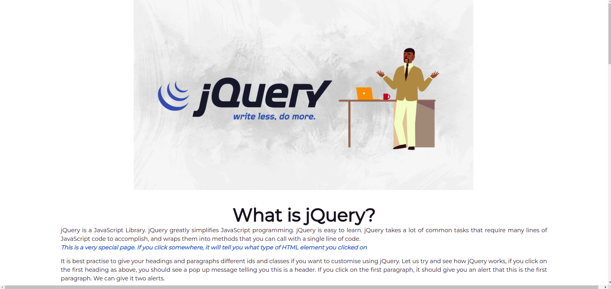
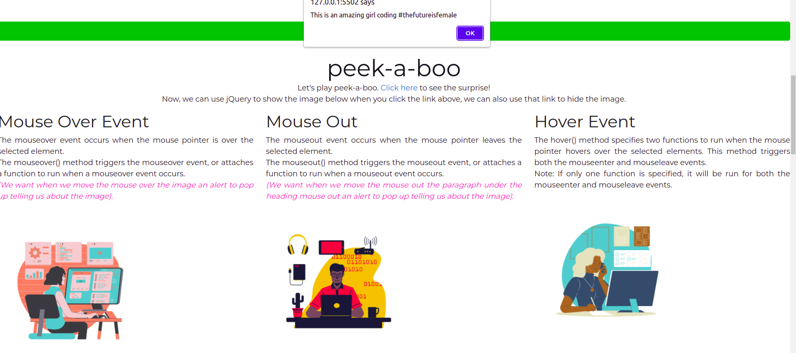
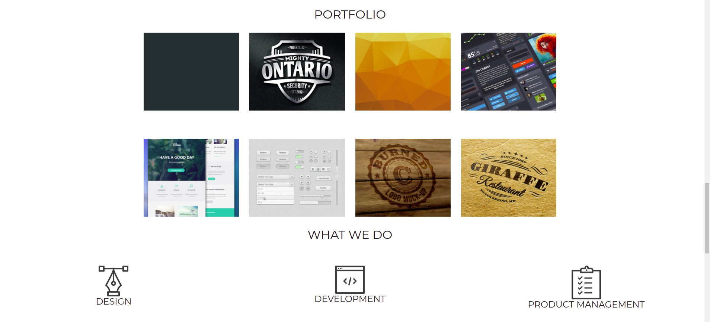
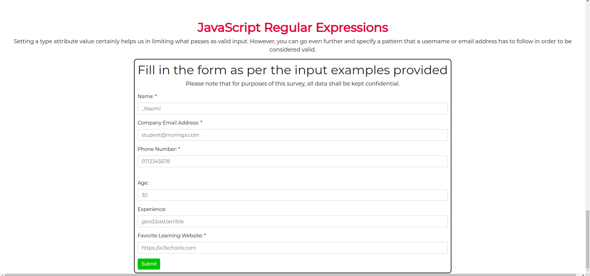

# Intro-to-jQuery

This is a webpage that applies what I learnt in jQuery.

### By Charmain Bonareri, 14/03/2022






## Table of contents
* [Description](#description)
* [Setup and Installation Requirements](#setup)
* [Behaviour Driven Development](#BDD)
* [Technologies](#technologies)
* [Licence](#licence)
* [Authors information](#contact)

## Description
jQuery is a JavaScript Library. jQuery greatly simplifies JavaScript programming. jQuery is easy to learn. jQuery takes a lot of common tasks that require many lines of JavaScript code to accomplish, and wraps them into methods that you can call with a single line of code.
This webpage applies the different styles I have learnt in jQuery to play around with html and css elements.


# Setup and Installation Requirements
To run this program:

```
$ Fork the repository from my git hub.
$ Clone this repository to a location in your file system.
$ Open terminal command line then navigate to the root folder of the application.
$ Run the code from VS Code or Atom through a liveserver to chrome browser.
$ Make changes where need be.
```
## Behaviour Driven Development (BDD)
This webpage is documented and designed around the behavior a user expects to experience when interacting with it.

| Behavior                                                                                                                                                                                                                                                                                   | input                                                     | output                                                                                                                       |
| ------------------------------------------------------------------------------------------------------------------------------------------------------------------------------------------------------------------------------------------------------------------------------------------ | --------------------------------------------------------- | ---------------------------------------------------------------------------------------------------------------------------- |
| User inputs name and email clicks on the submit button.On submit,validation is done first,then a message acknowledging the reciept of the message is outputted.Validation-On submit if there is any missing value in the fields, user gets an alert asking them to fill the missing value. | User types in their name, email address and their message | User recieves message alerting them that their message has been recieved and also if their email has been added to mail list |


## Technologies
* HTML - HTML is the standard markup language for Web pages.
* CSS - CSS is the language we use to style an HTML document.
* Bootstrap - is the most popular CSS Framework for developing responsive and mobile-first websites.
* Java Script - JavaScript is the programming language of the Web.
* jQuery -  is a lightweight, "write less, do more", JavaScript library. 

# Licence
MIT Licence 
copyright (c) 2022 Charmain Bonareri. All Rights Reserved.


## Authors information
Contributions are always welcome!  
If you have any questions,comments or correctional advice, feel free to contact me
* Email: mogerecharmain@gmail.com
* [LinkedIn](https://www.linkedin.com/in/charmain-bonareri-71a209126/)